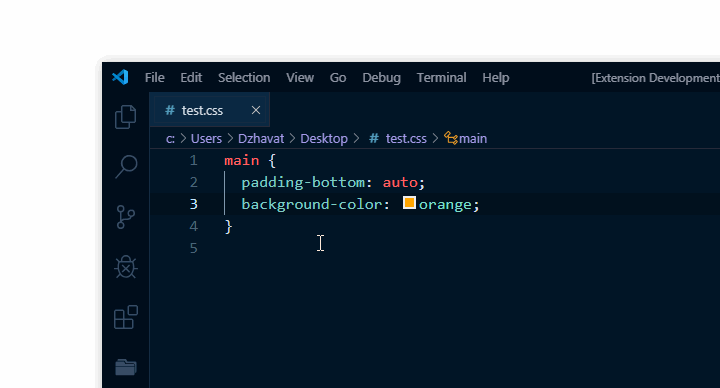

# CSS Initial Value ([link](https://marketplace.visualstudio.com/items?itemName=dzhavat.css-initial-value))

VS Code extension that shows the initial value of each property.

## Features

* Works with the following file types:
  * `.css`
  * `.scss`
  * `.sass`

## Demo

